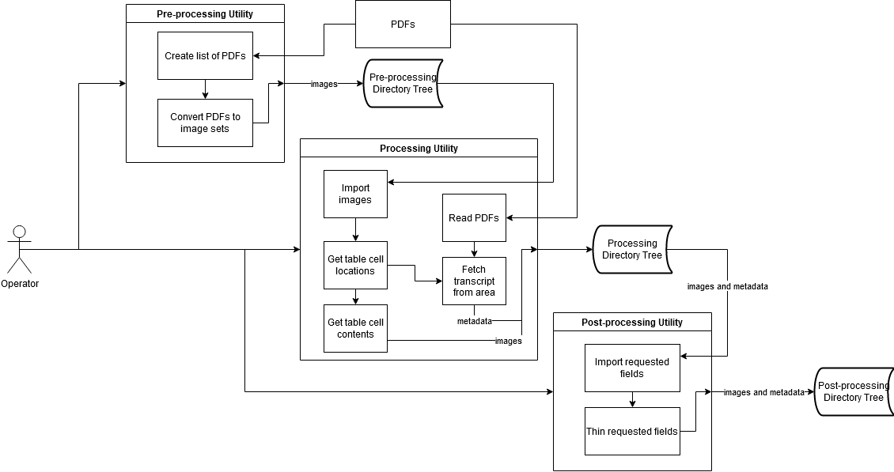
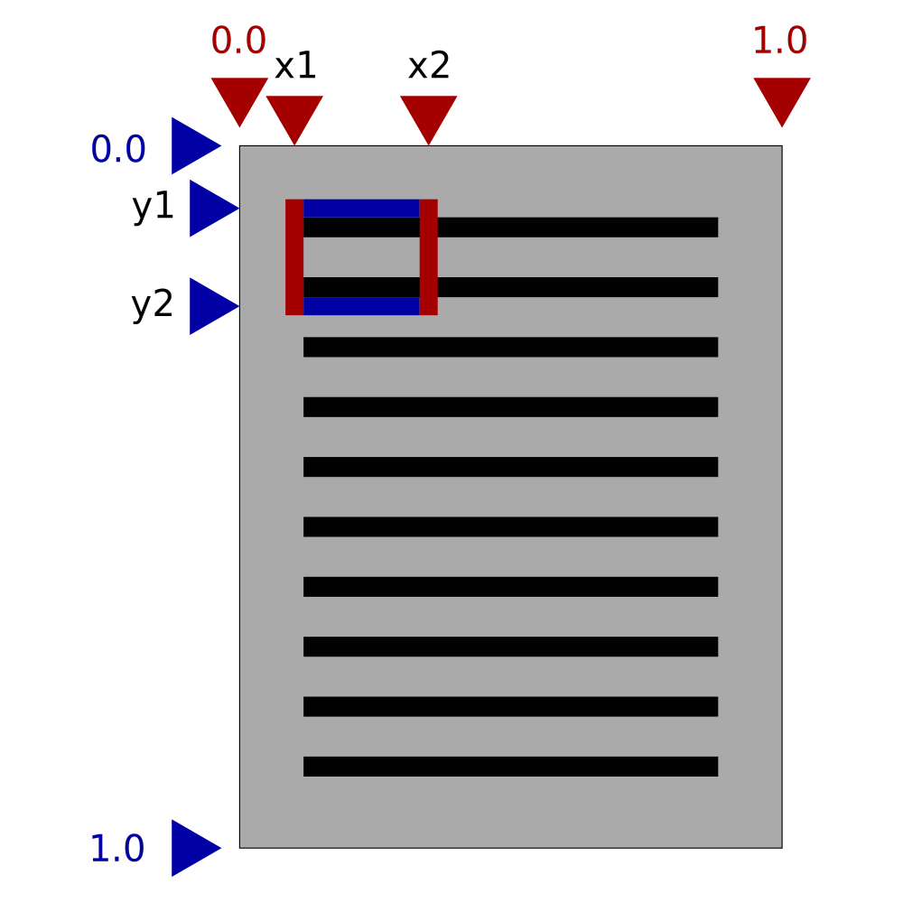

# Image Processing Utilities
A set of tools developed to extract and process PDF tables and associated transcripts.

NOTE:
 - These utilities are optimized for the Oracle Bone PDFs
 - All paths mentioned with `.` are relative to the directory containing this README
 - Extensions are case sensitive on some OSs, this utility expects them to be lowercase

## Installation
You will need to install the `poppler` dependency either manually or through your package manager of choice. It is recommended to install this package in development mode so modifications take effect immediately.
This can be done with either:
```
python setup.py develop
```
or
```
pip install -e .
```
Dependencies should be automatically resolved, but in case they aren't required dependencies are also listed in `./requirements.txt`

## Testing
This package takes advantage of the UnitTest library for automated unit testing of the 2 extraction classes. To run these tests navigate to the `./tests` directory and run either `python test_parser.py` or `python test_tablereader.py`. Alternatively, you may run all tests with `python -m unittest discover` in the `./tests` directory. Regardless, all tests should be run in the `./tests` directory.

## Usage
This package has three distinct processing steps that are split up to allow for easy modification. These commands are to be run in the directory containing all PDFs that are to be processed.

### Pre-processing
Image arrays must be generated and stored ahead of time due to the intense resource usage. This is out of my control and must be done for the computer vision side of this utility. This is done by running `pdfpreproc.py`. By default, we export the PDF at a respectable 300 DPI but this can be changed in `./pdfpreproc.py`. This will affect processing time and all generated file sizes so adjust this parameter sparingly.

### Processing
Simply run `pdfproc.py` in the directory containing the PDFs and their corresponding `*-pre` image directories you wish to extract. All available PDF-DIR pairs in this directory will be processed with the rules outlined in `./pdfproc.py`. All images generated will be stored in a `*-proc` directory tree.

### Post-processing
After extracting the required cells you may wish to perform some thinning or other processing routines on the directory tree generated. This utility has a tool to traverse these trees and do so automatically. Running `pdfpostproc.py` will perform the processing routines outlined in `./pdfpostproc.py` on any `*-proc` subdirectories in the current working directory. The output will be saved into a separate directory tree by default. Right now the images are binarized (all pixels either being 0 or 255) and thinned before being stored in the `*-proc` directory tree. If you do not wish to export these images into a separate tree, simple change the `outpath` variable.

### Cleanup
If you don't need to reread the PDF over and over then you may delete the `*-pre` directories to save space.

## Details


### Classes
This utility utilizes custom Parser and TableReader classes to keep track of the cell and PDF information respectively.

Parser public methods:
- `__init__(self, doc)`
  - Constructor
  - `doc` is the opened PDF file
  - Returns Parser
- `read_page(self, ipage)`
  - Compile a dictionary of text elements and their locations
  - `ipage` is the index of the page to process
  - Returns None
- `get_text(self, x_1, y_1, x_2, y_2)`
  - Find the text in the given area and return the sorted output
  - `x_1, y_1, x_2, y_2` is the percentage positioning as defined below
  - Returns String
 
 
 
 TableReader public methods:
 - `__init__(self, page)`
   - Constructor
   - `page` is the image array of the page to be processed
   - Returns TableReader
 - `get_cell(self, j, i)`
   - Fetch the image array at the specified cell
   - `j, i` is the index of the element in the verticle and horizontal axis respectively
   - Returns CV Image Array
 - `is_cell_empty(self, j, i)`
   - Check if the image at the given position is empty enough to ignore
   - `j, i` is the index of the element in the verticle and horizontal axis respectively
   - Returns Boolean
 - `get_cell_bounds(self, j, i)`
   - Fetch the bounds of specified cell following the positioning diagram above
   - `j, i` is the index of the element in the verticle and horizontal axis respectively
   - Returns List of (x_1, y_1, x_2, y_2)
 - `get_row(self, j)`
   - Fetch an entire row of images from the table
   - `j` is the index of the row
   - Returns List of CV Image Arrays
